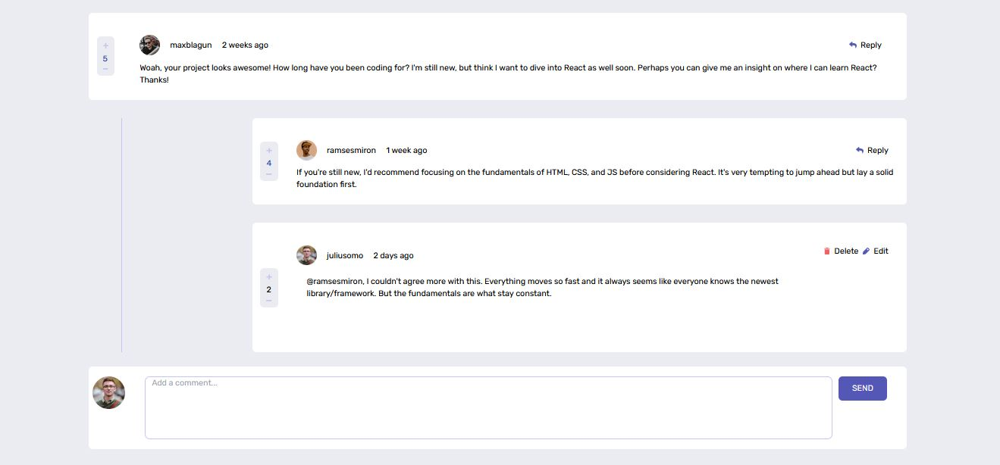

# interactive comments section

## Description

A fullstack, CRUD app and clone of the comment section of networking webapps like facebook. The user can creat, read, update and delete comments.

Challenged by Frontend mentor. 
[Click this link to see the coding challenge on frontend mentor](https://www.frontendmentor.io/challenges/interactive-comments-section-iG1RugEG9)

## Stack

- MERN
- Tailwind CSS

## Live Demo

[Live Demo Link](https://tabetommy.github.io/interactive-comments-section/)

## About the project meetup(features)

- Read comments
- Create comments
- Update comments
- Edit comments

## Lessons learned

- I learned how to work with json data, retrieving data for the app.

👤 **Author1**

- Website : [portfolio](https://tabetommy.github.io/website-portfolio/)
- Github: [tabetommy](https://github.com/tabetommy)
- Linkedin: [tabetommy](https://www.linkedin.com/in/tommy-egbe-304464116/)

